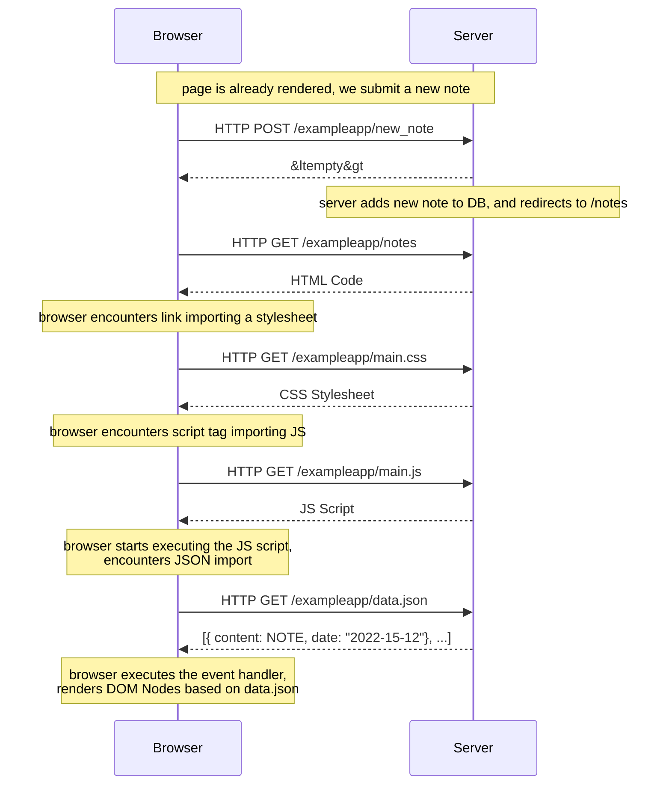

<h2 style="text-align: center"> Diagram for SSR Notes </h2> 

```mermaid
   sequenceDiagram
      participant B as Browser
      participant S as Server
      note over B,S: page is already rendered, we submit a new note
      B->>S: HTTP POST /exampleapp/new_note
      S-->>B: &ltempty&gt 
      note over S: server adds new note to DB, and redirects to /notes
      B->>S: HTTP GET /exampleapp/notes
      S-->>B: HTML Code
      note over B: browser encounters link importing a stylesheet
      B->>S: HTTP GET /exampleapp/main.css
      S-->>B: CSS Stylesheet
      note over B: browser encounters script tag importing JS
      B->>S: HTTP GET /exampleapp/main.js
      S-->>B: JS Script
      note over B: browser starts executing the JS script, <br> encounters JSON import
      B->>S: HTTP GET /exampleapp/data.json
      S-->>B: [{ content: NOTE, date: "2022-15-12"}, ...]
      note over B: browser executes the event handler, <br>renders DOM Nodes based on data.json
```