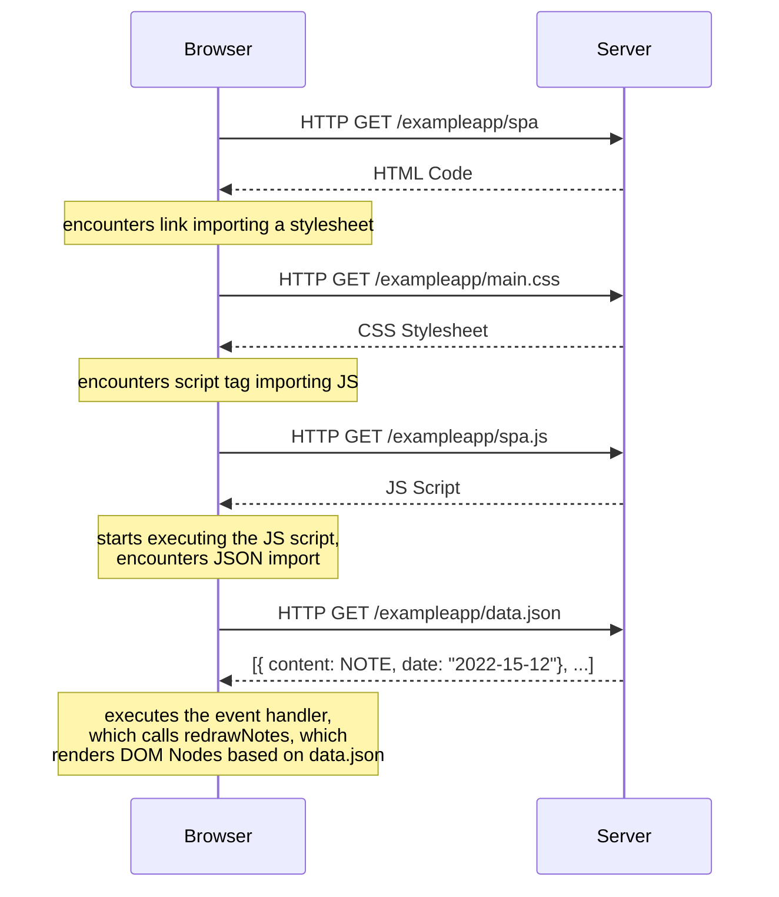

<h2 style="text-align: center"> Diagram for SPA Notes </h2> 

I believe it is identical to the usual example app,  except the note adding part.

```mermaid
   sequenceDiagram
      participant B as Browser
      participant S as Server
      B->>S: HTTP GET /exampleapp/spa
      S-->>B: HTML Code
      note over B: encounters link importing a stylesheet
      B->>S: HTTP GET /exampleapp/main.css
      S-->>B: CSS Stylesheet
      note over B: encounters script tag importing JS
      B->>S: HTTP GET /exampleapp/spa.js
      S-->>B: JS Script
      note over B: starts executing the JS script, <br> encounters JSON import
      B->>S: HTTP GET /exampleapp/data.json
      S-->>B: [{ content: NOTE, date: "2022-15-12"}, ...]
      note over B: executes the event handler, <br> which calls redrawNotes, which <br> renders DOM Nodes based on data.json
```
