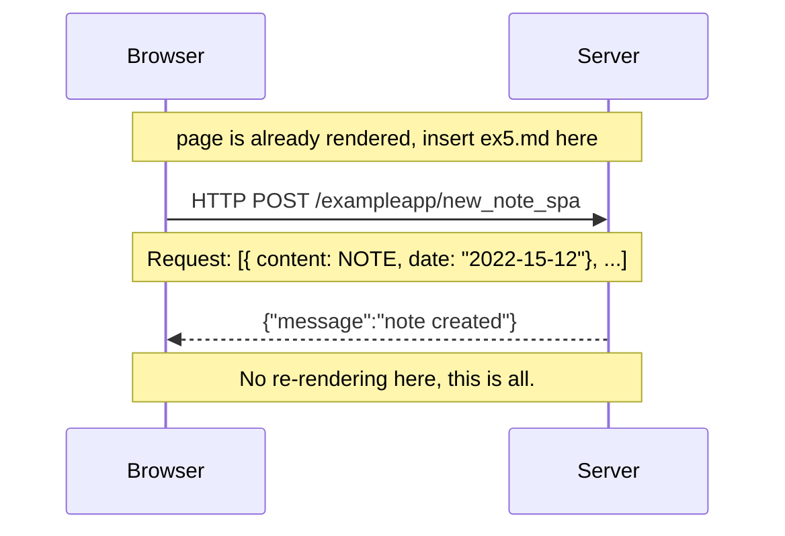

<h2 style="text-align: center"> Diagram for SPA Notes - new note</h2> 

```mermaid
   sequenceDiagram
      participant B as Browser
      participant S as Server
      note over B,S: page is already rendered, insert ex5.md here
      B->>S: HTTP POST /exampleapp/new_note_spa
      note over B,S: Request: [{ content: NOTE, date: "2022-15-12"}, ...]
      S-->>B: {"message":"note created"}
      note over B,S: No re-rendering here, this is all. 
```